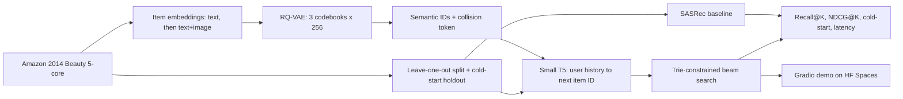

# Generative recommender with semantic IDs

## Goal

Ship a public repo, a live demo and a write-up, all at zero cost.
Together they should support these resume bullets:

- "Built a generative recommender (RQ-VAE semantic IDs + transformer decoder) that improved Recall@10 by X% over SASRec, and cold-start recall by Y%, on Amazon Reviews."
- "Showed that multimodal semantic IDs (text + image) raise cold-start NDCG@10 by Z%, with ablations over codebook depth and ID collisions."
- "Served it with trie-constrained beam search at N ms p95 on CPU, with a live demo on Hugging Face Spaces."

## Free stack, checked against this Mac

The Mac is an Apple M4 Pro with 14 cores and 24 GB RAM, which is enough to train every model here with PyTorch on MPS.

- Compute: the Mac first.
Fallbacks are Kaggle Notebooks, which give 30 free GPU hours a week, and Google Colab free tier.
- Environment: `uv` is already installed.
Pin Python 3.12, because the system Python 3.14 may not have PyTorch wheels yet.
- Libraries, all open source: `torch`, `transformers`, `sentence-transformers`, `open_clip_torch`, `pandas`, `numpy`, `matplotlib`, `gradio`, `pytest`.
- Data: the Amazon 2014 Beauty 5-core reviews and Beauty metadata from the McAuley lab page, which are free with no signup.
Amazon Reviews 2023 on Hugging Face is the fallback, and it's also free.
- Experiment tracking: results go to JSON files, and plots come from matplotlib.
No paid tracker.
- Code hosting: a public GitHub repo, using the `gh` CLI that's already installed.
- Model hosting: the Hugging Face Hub, free for public models.
- Demo: Hugging Face Spaces on the free "CPU basic" tier with Gradio.
Gradio also exposes an HTTP API automatically, so there's no separate FastAPI service to build.
- Write-up: the README, plus a post on the Hugging Face community blog or GitHub Pages.

## Blocker to fix first: disk space

Only 24 GB is free, and the disk is 95% full.
The project needs roughly 8-10 GB: about 3 GB for torch and the other libraries, about 1.5 GB for data, about 2 GB for model weights and caches, and room for checkpoints.
Free up space before starting so there's at least 20 GB of headroom.
Set `HF_HOME=./.hf_cache` inside the project so every model cache stays in one folder you can delete.

## Pipeline

## Key decisions

- Use Amazon 2014 Beauty first, because the TIGER paper reports numbers on it.
The dataset is small: about 22k users, 12k items and 198k reviews.
Add the Sports and Toys categories only after Beauty matches.
- Reproduction targets from the TIGER paper, to double-check against its table while working:
SASRec gets roughly Recall@10 0.060 and NDCG@10 0.032, and TIGER gets roughly Recall@10 0.065 and NDCG@10 0.038.
- Write SASRec in plain PyTorch, which takes about 100 lines.
RecBole is poorly maintained against current torch versions, and owning the code makes it easy to defend in interviews.
- Compute item embeddings with an off-the-shelf sentence-transformers model on title, brand, categories and price.
For the multimodal extension, concatenate CLIP image embeddings.
- Train a tiny T5 from a config, not from pretrained weights.
It has about 4 encoder and 4 decoder layers with d_model 128.
The vocabulary is special tokens + 3x256 codebook tokens + collision tokens + hashed user tokens.
Expect runs in the low hours on MPS.
Set `PYTORCH_ENABLE_MPS_FALLBACK=1` for ops MPS doesn't support.
- For constrained decoding, use Hugging Face `generate(..., prefix_allowed_tokens_fn=...)` backed by a dict-based trie of valid IDs.
No custom beam search.
- Use community TIGER implementations, like the RQ-VAE-Recommender repo and Snap's GRID, only to cross-check numbers.

## No leakage rules

Leakage means a model learns from information it would not have at prediction time, such as the answer or data from the future.
These rules apply to every stage and every run.

- The test set is only used to report final numbers.
Every choice, such as epochs, learning rate, codebook size or beam size, is made on the validation set.
- Every model is scored on two splits.
The leave-one-out split holds out each user's last item, which matches the TIGER paper so numbers can be compared.
The time split cuts all users at the same two dates, 2014-03-07 and 2014-05-13, so no model ever trains on a review written after any test review.
- Anything learned from data, such as popularity counts, learned item vectors, normalization statistics or the RQ-VAE codebooks, is fit on training data only.
- The RQ-VAE is fit only on the content of items that appear in training.
Cold items and items first seen after a cutoff get their semantic IDs by passing through the frozen RQ-VAE.
- The pretrained text and image encoders stay frozen.
They never see our validation or test interactions.
- In the cold-start study, cold items never appear in any training sequence, and never in RQ-VAE training.
- [test_core.py](test_core.py) checks the split rules and fails if one breaks.

We do not use nested cross-validation.
It solves a different problem: picking settings on small data without touching the test set.
Here a fixed validation set of 22,363 cases (5,881 on the time split) already does that job.
Shuffled folds would also put future reviews into training, which the time split exists to prevent.

One known leak stays, because the benchmark has it.
The 5-core filter keeps users and items with at least 5 reviews counted over all time, including reviews after the cutoffs.
TIGER and the SASRec papers use the same filtered file, and the write-up states this.

## Image risk for the multimodal extension

The 2014 metadata image URLs point at an old Amazon CDN and may be dead.
The plan is to try downloading the roughly 12k Beauty item images first.
If too many fail, there are two free fallbacks.
One is to stream the free per-category precomputed CNN image features file and keep only Beauty's 12k items.
The other is to map items to the 2023 metadata by ASIN, where the image URLs still work.

## Unique extension, beyond reproducing the paper

Cold-start study: hold out 10% of items entirely from training sequences.
RQ-VAE still assigns them semantic IDs from content alone, so the generative model can recommend items it never saw in training, while SASRec can't.
Compare SASRec, text-only semantic IDs and text+image semantic IDs on those items.
This comparison is the headline of the write-up.

Ablations: random IDs vs semantic IDs, codebook depth of 2, 3 or 4, beam size vs recall vs latency, and codebook utilization.

## Repo layout (flat, few files)

- `data.py`: download, parse, 5-core check, leave-one-out split, cold-start holdout
- `embed.py`: text and image item embeddings
- `rqvae.py`: RQ-VAE training and semantic ID assignment with the collision token
- `sasrec.py`: popularity baseline and SASRec
- `genrec.py`: T5 training and trie-constrained generation
- `evaluate.py`: metrics, ablation tables, plots and the CPU latency benchmark
- `app.py`: Gradio demo, the same file deployed to HF Spaces
- `test_core.py`: one small assert-based check covering no leakage in the split, trie decoding only emitting valid IDs, and Recall@K on a toy case
- `pyproject.toml`: dependencies managed by uv
- `README.md`: results table, latency numbers, ablation plots, and how to reproduce

## Execution order, about 6 weeks part-time

- Week 0, one evening: free disk space, `uv init` with Python 3.12, install dependencies, `git init`, create the public GitHub repo with `gh repo create`
- Week 1: `data.py`, the popularity baseline and SASRec, landing near the published Beauty numbers
- Week 2: `embed.py` and `rqvae.py`, checking codebook utilization and collision rate
- Weeks 3-4: `genrec.py` with constrained decoding, reproducing TIGER-level Recall and NDCG.
If an MPS run takes too long, move that single run to Kaggle.
- Week 5: the cold-start and multimodal extension, plus ablations
- Week 6: push the model to the HF Hub, deploy `app.py` to Spaces, run the latency benchmark, then write the README, blog post and final resume bullets

## Total cost

Zero.
The only thing that could cost money is a long GPU run, and Kaggle's free weekly quota covers that.
